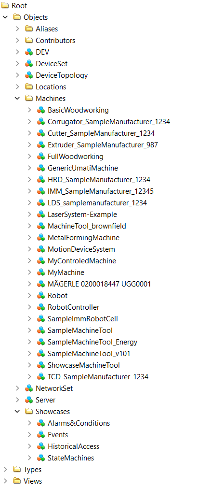

# SampleServer-node-opcua

  

OPC UA Sample Server based on [node-opcua](https://github.com/node-opcua/node-opcua)  
the official book node-opcua: [node-opcua by example](https://leanpub.com/node-opcuabyexample-edition2024) by [Sterfive](https://www.sterfive.com)  
API Docs: [2.32.0](https://node-opcua.github.io/api_doc/2.32.0/index.html)  
  
## Usage

- `download and unpack`  
- `open folder in VS Code (or in terminal)`  
- `npm install`  
- `npm run start`

## Example Users

User: `admin` Password: `pw1`  
User: `operator` Password: `pw2`  
User: `guest` Password: `pw3`  

## Ephemeral Dev Environment

- [Click](https://gitpod.io/#https://github.com/AndreasHeine/SampleServer-node-opcua)
- `npm run start`
- split terminal: `opcua-commander -e opc.tcp://localhost:4840/UA` to have a local OPC UA client
  
## Docker  

Set "IP" and "PORT" in env:

- `docker run -it -p 4840:4840 -e PORT=4840 -e IP=127.0.0.1 --name sampleserver-node-opcua ghcr.io/andreasheine/sampleserver-node-opcua:main`  
  
## Online Server Instance  

- `opc.tcp://opcua.umati.app:4843`  
  
## Implementations of OPC UA Companion Specifications
  

## OPC UA Pub/Sub over MQTT  
  
MQTT-Broker: `mqtt://broker.hivemq.com:1883`  
MQTT-Topic: `umati/#`  
  
## License

Unless otherwise specified, source code in this repository is licensed under the [Apache 2.0 License](LICENSE).
